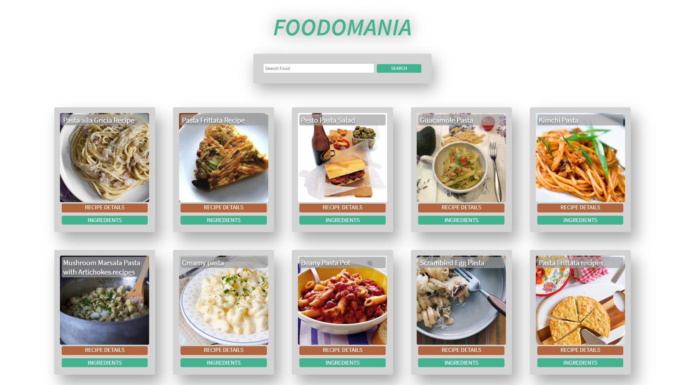

# **Food-App**

## **Introduction**

This is a code repository for **Food-App**.

We have created this project by using React on the frontend and we'll make get requests to **EDAMAM Recipe Search API** for Recipes relates to the dish/Food entered by the User.

## **Live Deployment** 📦 

Click Here to view the deployment!  

## **Tech Stack**
 